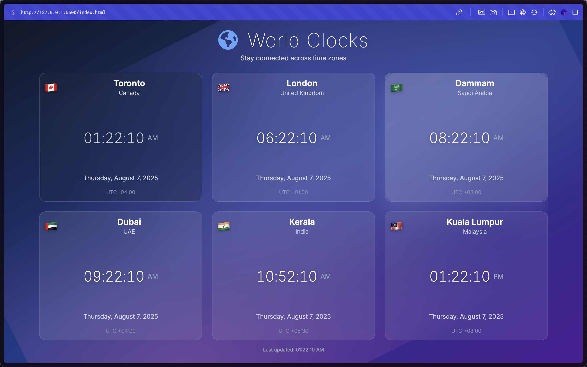

# World Clocks

A responsive real-time world clock application displaying multiple timezones simultaneously with modular ES6 architecture.



## Overview

World Clocks is a clean, responsive web application built with vanilla JavaScript that displays real-time clocks for multiple timezones around the world. Features a modular ES6 class-based architecture with performance optimizations and accessibility support.

**Status:** Fully functional with dynamic city management, automatic UTC offset sorting, and responsive grid layout. Performance optimizations include pausing updates when tab is not visible.

## Key Features

- **Real-time Updates** - All clocks update every second with accurate timezone information using `Intl.DateTimeFormat`
- **Multiple Timezones** - Display time for multiple cities simultaneously with automatic UTC offset sorting
- **Responsive Design** - CSS Grid layout that adapts from 1 column on mobile to 4+ columns on large screens
- **Modular Architecture** - Clean ES6 class-based architecture with separate modules for different concerns
- **Dynamic Management** - Add or remove cities at runtime through JavaScript API or configuration file
- **Performance Optimized** - Updates pause when browser tab is not visible to save resources
- **Accessibility** - Keyboard navigation, ARIA labels, and screen reader support

## Quick Start

1. Clone the repository and navigate to the project directory
2. Start a local web server (required for ES6 modules)  
3. Open `http://localhost:8000` in your browser

> **Note**: A web server is required due to ES6 module imports and CORS restrictions.

## Architecture

The application uses a modular ES6 class-based architecture with clear separation of concerns:

- **WorldClocksApp** - Main application controller handling initialization and coordination
- **WorldClock** - Individual clock component with rendering logic and time updates  
- **TimeZoneUtils** - Utility functions for timezone calculations and formatting
- **GridManager** - Responsive grid layout management and card positioning
- **EventManager** - User interaction and event handling across components

## Technical Stack

- **JavaScript ES6+** - Modern JavaScript with classes and modules
- **HTML5** - Semantic markup and modern web standards
- **CSS3** - Modern styling with Grid and Flexbox
- **CSS Grid** - Responsive layout system
- **Tailwind CSS** 2.2.19 - Utility-first CSS framework
- **Font Awesome** 6.0.0 - Icon library
- **Intl.DateTimeFormat API** - Native browser timezone handling

## Project Structure

```
times/
├── index.html              # Main application entry point
├── cities.js               # City configuration
├── cover.png              # Application screenshot
├── src/
│   ├── constants.ts        # Project metadata and structure
│   ├── js/
│   │   ├── WorldClocksApp.js    # Main application controller
│   │   ├── WorldClock.js        # Individual clock component
│   │   ├── TimeZoneUtils.js     # Timezone utilities
│   │   ├── GridManager.js       # Layout management
│   │   └── EventManager.js      # Event handling
│   └── css/
│       ├── main.css            # Main stylesheet
│       ├── base.css            # Base styles
│       ├── grid.css            # Grid layout
│       ├── clock-elements.css  # Clock styling
│       ├── animations.css      # Animations
│       └── components/         # Component styles
└── config/                     # Configuration files
```

## Configuration

### Adding Cities

Edit the `WORLD_CITIES` array in `cities.js`:

```javascript
const WORLD_CITIES = [
  {
    timezone: "America/New_York",
    city: "New York",
    country: "United States",
    flag: "🇺🇸",
  },
  {
    timezone: "Europe/London",
    city: "London",
    country: "United Kingdom",
    flag: "🇬🇧",
  },
  // Add more cities...
];
```

### Dynamic Operations

```javascript
// Add cities at runtime
worldClocks.addTimezone("Asia/Tokyo", "Tokyo", "Japan", "🇯🇵");

// Remove cities
worldClocks.removeTimezone("Tokyo");

// Get all cities
const cities = worldClocks.getAllCities();
```

## Demo & Links

- **Live Demo:** [https://shaheem-pp.github.io/times-es6/](https://shaheem-pp.github.io/times-es6/)
- **Source Code:** [https://github.com/shaheem-pp/times-es6](https://github.com/shaheem-pp/times-es6)

## Technical Highlights

- Built with vanilla JavaScript ES6+ classes and modules for clean separation of concerns
- Utilizes modern web APIs like `Intl.DateTimeFormat` for accurate timezone handling
- CSS Grid and Flexbox for responsive layout without external grid frameworks
- Component-based CSS architecture with modular stylesheets
- Performance optimizations including efficient DOM updates and visibility-based pausing

### Browser Compatibility
- Chrome 88+ | Firefox 78+ | Safari 14+ | Edge 88+

World Clocks demonstrates modern vanilla JavaScript development practices with a focus on performance, accessibility, and maintainable code architecture.

## Development

### Local Setup

1. Clone this repository:
   ```bash
   git clone https://github.com/shaheem-pp/times-es6.git
   cd times-es6
   ```

2. Start a local web server (required for ES6 modules):
   ```bash
   # Using Python
   python -m http.server 8000
   
   # Using Node.js
   npx serve
   
   # Using PHP  
   php -S localhost:8000
   ```

3. Open `http://localhost:8000` in your browser

> **Note**: A web server is required due to ES6 module imports and CORS restrictions.

### Project Metadata

This project follows a structured format with metadata defined in `src/constants.ts`:

```typescript
export interface Project {
  title: string;
  image: string;
  shortContent: string;
  description: string;
  links: { [iconClass: string]: string | undefined };
  stack: string[];
  status: string;
  category: string;
  featured: boolean;
}
```

Category: **Personal Project** | Status: **Completed** | Featured: **Yes**

## Contributing

1. Fork the repository
2. Create a feature branch (`git checkout -b feature/new-feature`)
3. Commit your changes (`git commit -am 'Add new feature'`)
4. Push to the branch (`git push origin feature/new-feature`)
5. Create a Pull Request

## License

This project is open source and available under the [MIT License](LICENSE).
